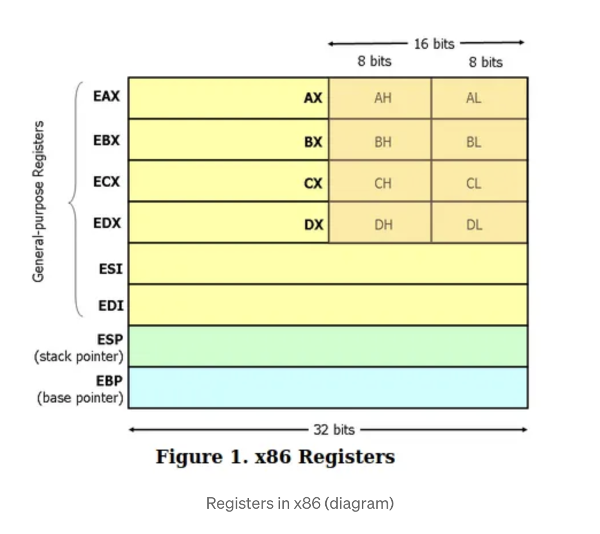

# AvengerAssembly!

Curious about asm, last time I coded was for an Epitech Pool

Get back on a tutorial for Linux x86, needed to find alternative for my mac arm64 (AArch64)

Source :
- [tuto_asm_x86](https://pablocorbalann.medium.com/programming-a-hello-world-in-assembly-from-the-first-line-to-the-end-x86-9c48fb499238)
- [tuto_asm_arm64](https://annurdien.medium.com/hello-world-with-arm64-assembly-on-apple-silicon-chip-f7a9406f8380)
    - Just the len of string ``#14`` hardcoded from the **arm64 tutorial**, not good, I found we can ``. - var`` to have a len().
    - .align :
        - .align 2 (4 bytes) is the standard alignment for Apple Silicon (M1/M2/M3/M4) [source](https://github.com/below/HelloSilicon)

        - .align 4 (16 bytes) is an alternative, more conservative alignment, recommended for optimization on some ARM64 processors (Cortex-A53/A57, Neoverse N1) [source](https://patchwork.ozlabs.org/project/gcc/patch/DB3PR08MB0089D8CEBDA026094271E69483590@DB3PR08MB0089.eurprd08.prod.outlook.com/)

## How to run it
```bash
make && ./hello
```